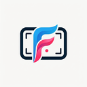
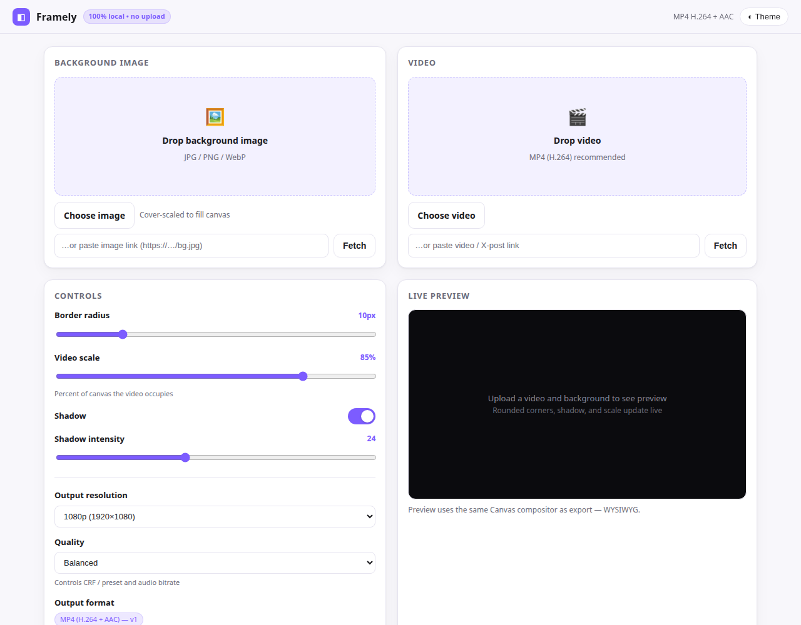

<div align="center">



# Framely

### Give any screen recording a studio look.

**Framely** — short for *frame beautifully* — is a Chrome extension (Manifest V3) that centers your video on a background image with rounded corners and a soft shadow. It runs **100% client-side**: no upload, no server, no account. Your footage never leaves your machine.

| The old way | With Framely |
|---|---|
| Open Premiere / After Effects for a simple frame | Drop video + background, done in 30 seconds |
| Upload your recording to some online tool | Everything renders locally — nothing is uploaded, ever |
| Re-encode and lose quality, fps, or audio sync | Single-pass overlay: source fps, duration & audio preserved |
| Manually fetch X/Twitter videos with shady downloaders | Paste a tweet link → pick quality → import from the CDN |

</div>

<div align="center">


[Install](#install) · [See it in action](#-see-it-in-action) · [How it works](#-how-it-works) · [Roadmap](#-roadmap) · [Contributing](#-contributing)

</div>

> **No tracking, no servers, no uploads** — the extension's only network requests are the ones *you* trigger: fetching a pasted link or loading the encoder from its bundled files. The code is open, go read it.

## 🎬 See it in action

<video src="./assets/demo.mp4" poster="./assets/demo-poster.png" controls preload="metadata" width="100%"></video>

*Full flow: paste an X link → quality picker → generate → download. (Recorded on v1 — same flow, fresh coat of paint.) Can't play the video? [Download it directly](./assets/demo.mp4).*



## ✨ Features

- 🖼️ **Drag & drop** background (JPG/PNG/WebP) + video (MP4) with live preview and metadata (resolution, duration, size)
- 🔗 **Paste direct links** for video + background — fetched straight into the extension, per-site permission granted only when you fetch
- 🐦 **X/Twitter extraction** — paste a tweet link, pick a quality, import from the CDN with your own login. Zero servers.
- 🎛️ **Real controls** — border radius (0–50px), video scale (50–95%), shadow toggle + intensity, output resolution (1080p / 1440p / 4K / source), quality presets (Fast / Balanced / High)
- 🎯 **Faithful output** — source fps measured exactly (via rVFC) and preserved; duration-accurate; audio copied when AAC, re-encoded otherwise
- 🌙 **Dark mode** (system + manual toggle) and one-variable rebrand (`--accent-color: #7c5cff`)
- ⚠️ **Honest limits** — soft warn at 200MB (no hard block), friendly errors for corrupted files, unsupported codecs, OOM, and stalls

## 📦 Install

Prereqs: Node 18+, Chrome/Edge 120+.

```bash
npm install
npm run build   # outputs dist/ — this IS the extension
```

1. Open `chrome://extensions` → enable **Developer mode**
2. **Load unpacked** → select the **`dist/` folder** — not the project root
3. Click the extension icon → the studio tab opens
4. Drop a video + background, tweak, **Generate Video**, **Download MP4**

> ⚠️ **Always load `dist/`, never the project root.** The root `manifest.json` points at unbundled `src/` and will fail with `Failed to resolve module specifier "@ffmpeg/ffmpeg"`. If the dropzones do nothing: you loaded the wrong folder — remove it, `npm run build`, load `dist/`.

After rebuilding: `npm run build`, then ↻ **Reload** on the extension card. Confirm the bundle hash in the console before debugging — a stale `dist/` is the #1 cause of ghost bugs.

Dev mode (live reload, page only — not for extension CSP):

```bash
npm run dev  # http://localhost:5173/src/page/studio.html
```

## 🧭 Usage

1. **Upload** a background (cover-scaled) and a video — or paste direct links / a tweet link
2. **Adjust** radius / scale / shadow — the preview is WYSIWYG (same geometry code as export)
3. **Pick** resolution (1080p default) and quality (Balanced; long clips auto-drop to a faster preset, logged to console)
4. **Generate** — one composite pass; the result plays inline
5. **Download** — `framely-<timestamp>.mp4`, plays in VLC/QuickTime/everywhere

### Import from URL & X

- **Direct file links** (`https://…/clip.mp4`, `https://…/bg.jpg`): paste into the "…or paste link" field → **Fetch**. Caps: 500 MB video / 25 MB image. Wrong content-type, 404s, oversize, and hotlink-blocked hosts show a friendly error.
- **X/Twitter post links**: paste a tweet URL → the extension reads the MP4 versions the page loads → **quality picker** → download from the CDN. Other platforms (YouTube/Facebook/…) get a guided download-then-drop fallback.

> Use the X extractor for content you own or are permitted to reuse.

## ⚙️ How it works

```
Drop / paste URL / X-extract  →  video File + bg image
  → detectSourceFps (rVFC, snapped 24/25/30/50/60)
  → renderBackgroundStill (cover bg + shadow + punched rounded window, PNG)
  → renderVideoMask (black + white rounded rect, PNG)
  → compositePipeline: ONE ffmpeg pass
      [1:v]scale,rgba[fg]; [fg][2:v]alphamerge[fgm];
      [0:v][fgm]overlay=x:y → libx264 + audio (copy iff AAC)
  → MP4 H.264 + AAC, source fps/duration preserved
```

- **Dedicated tab** (`src/page/studio.html`) via `chrome.action.onClicked` — full viewport, survives service-worker idle. Not a popup.
- **One geometry source**: `computeVideoRect()` in `src/lib/compositor.js` — preview = still = mask = overlay rect, even-snapped for `yuv420`.
- **Single-thread FFmpeg.wasm** (`@ffmpeg/core` in `vendor/ffmpeg/`) — no CDN, CSP `wasm-unsafe-eval` only, no `SharedArrayBuffer`.
- **Deterministic builds** — two consecutive builds → identical bundle hash.

```
.
├── manifest.json
├── vite.config.js
├── vendor/ffmpeg/          # ffmpeg-core.js + .wasm (~31MB) — local, no CDN
├── icons/                  # 16 / 48 / 128 px extension icons
├── assets/                 # README media (demo video, screenshots)
├── src/
│   ├── background.js       # opens/focuses the studio tab
│   ├── content/
│   │   ├── x-main-hook.js  # MAIN-world X observer (fetch/XHR/DOM layers)
│   │   └── x-bridge.js     # isolated-world relay to the studio
│   ├── page/               # studio.html / studio.css / studio.js
│   └── lib/                # compositor, ffmpeg-worker, file-utils,
│                           # url-import, x-extract, constants
└── dist/                   # built extension (load unpacked from here)
```

## 🎨 Rebrand

```css
/* src/page/studio.css */
:root { --accent-color: #7c5cff; }
```

One line. Buttons, sliders, progress, focus rings — all follow.

## 🧰 Scripts

- `npm run build` — production build to `dist/`
- `npm run dev` — Vite dev server
- `npm run preview` — preview the build

## 🗺️ Roadmap

- [ ] `chrome.tabCapture` recording with manual crop — platform-agnostic capture for any site
- [ ] `chrome.downloads.download()` + `showSaveFilePicker()` for reliable saves
- [ ] Batch export queue + "download all as ZIP"
- [ ] License finalization (leaning AGPL-3.0 for the open core)

## 🤝 Contributing

PRs welcome! The core promise — **everything here stays free, open, and 100% local** — is non-negotiable. No servers, no tracking, no uploads.

1. Fork → branch → `npm run build` → verify via Load unpacked (`dist/`)
2. Confirm the bundle hash in the console before/after your change
3. Open a PR describing what changed and how you tested it

## 👤 Author

**[Rafa Lamb](https://rafalamb.dev)** — I build products in public and write about it weekly. Framely is one of them: an open-core Chrome extension, free and local-first by design.
